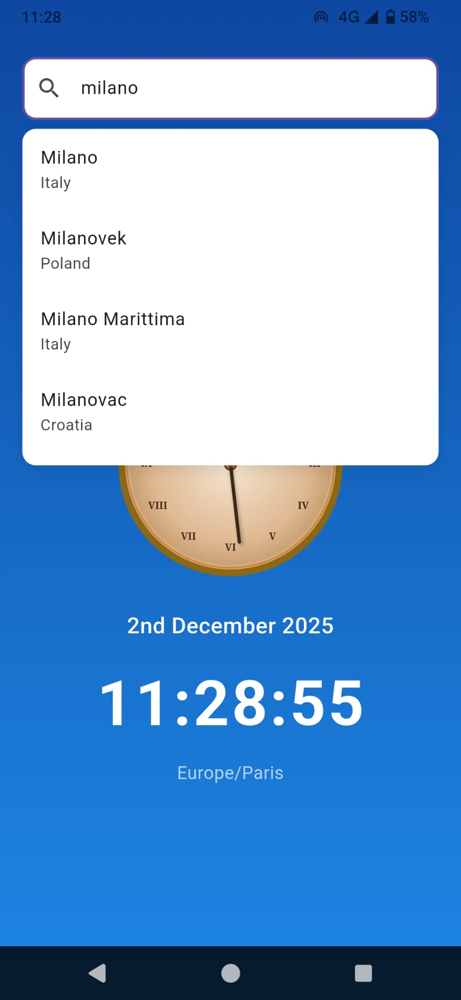
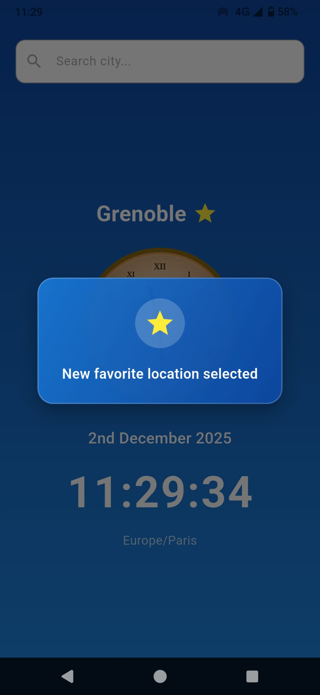
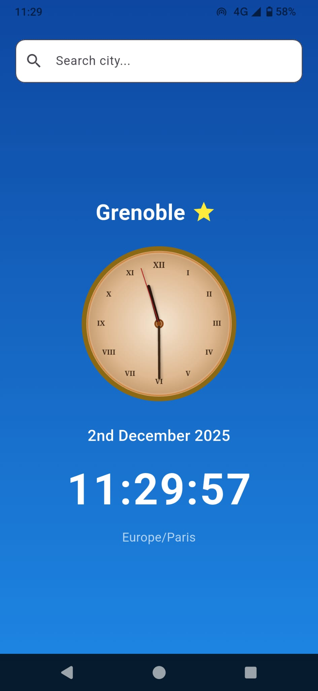

# 🌍 World Clock App

<p align="left">
  
</p>

<strong>A beautiful Flutter app to check the time in any city worldwide</strong>

<em>Developed with the assistance of Claude AI by Anthropic</em>

---

## ✨ Features

- 🔍 **Search 11+ Million Cities** - Find any city in the world instantly using the GeoNames API
- ⭐ **Favorite Locations** - Save your preferred city and the app will open directly to it
- 🕐 **Beautiful Vintage Analog Clock** - Stunning clock face with Roman numerals and classic design
- 📍 **Automatic Geolocation** - Detects your local timezone automatically, with Greenwich Time fallback
- 📱 **Responsive Design** - Works perfectly in both portrait and landscape orientations
- 📅 **Date Display** - Shows the date with ordinal numbers (e.g., "17th October 2025")
- 🎨 **Clean Interface** - Simple, elegant design with smooth animations

---

## 📱 Screenshots


<p align="center">
  
  
  
  
</p>

<p align="center">
  
</p>

---

## 🛠️ Tech Stack

- **Framework:** Flutter 3.35.6
- **Language:** Dart
- **APIs:** 
  - [GeoNames](https://www.geonames.org/) - City search and timezone data
- **Packages:**
  - `geolocator` - Location services
  - `timezone` - Timezone management
  - `http` - API calls
  - `shared_preferences` - Local data persistence
  - `intl` - Date/time formatting

---

## 🚀 Getting Started

### Prerequisites

- Flutter SDK (3.0 or higher)
- Dart SDK
- Android Studio / VS Code with Flutter extensions
- A GeoNames account (free) for API access

### Installation

1. **Clone the repository:**
```bash
   git clone https://github.com/YOUR_USERNAME/world-clock-app.git
   cd world-clock-app
```

2. **Install dependencies:**
```bash
   flutter pub get
```

3. **Configure GeoNames API:**
   - Create a free account at [GeoNames](https://www.geonames.org/login)
   - Enable web services in your account settings
   - Update `lib/services/city_service.dart` with your username:
```dart
     static const String _username = 'YOUR_GEONAMES_USERNAME';
```

4. **Run the app:**
```bash
   flutter run
```

---

## 🏗️ Project Structure
```
lib/
├── main.dart                 # App entry point and main logic
├── models/
│   └── city.dart            # City data model
├── services/
│   ├── city_service.dart    # City search functionality
│   ├── favorites_service.dart  # Favorites management
│   └── location_service.dart   # Geolocation handling
└── widgets/
    ├── city_search.dart     # Search bar widget
    └── world_clock.dart     # Analog clock widget
```

---

## 🎨 Design Highlights

### Vintage Analog Clock
- Custom-painted clock face using Flutter's `CustomPainter`
- Roman numerals for classic aesthetic
- Three hands: hours (thick), minutes (medium), seconds (thin red)
- Bronzed border with gradient background
- Real-time updates every second

### Adaptive Layout
- **Portrait mode:** Vertical stack with city name, clock, date, digital time
- **Landscape mode:** Horizontal layout with clock on left, time info on right
- Automatic keyboard dismissal for better UX

### Favorite System
- Persistent storage using SharedPreferences
- Yellow star indicator for favorite cities
- Beautiful popup notifications with custom animations

---

## 🤖 Development with AI

This project was developed with the assistance of **Claude AI** (Anthropic). The AI provided:

- ✅ Complete Flutter architecture and code structure
- ✅ API integration with GeoNames
- ✅ Custom analog clock implementation with `CustomPainter`
- ✅ Geolocation services and timezone handling
- ✅ Responsive UI design for multiple orientations
- ✅ Local data persistence for favorites
- ✅ Debugging and problem-solving throughout development
- ✅ Best practices for Flutter app development

The collaboration between human creativity and AI assistance enabled rapid development while maintaining code quality and learning opportunities.

---

## 🔐 Privacy

- **Location data** is used only to determine your local timezone
- No personal data is collected, stored, or shared
- All data remains on your device

---

## 📄 License

This project is open source and available under the [MIT License](LICENSE).

---

## 👨‍💻 Author

**Paolo Zanini**

📨 **Email:** [paolodevapp@gmail.com](mailto:paolodevapp@gmail.com)

💼 **LinkedIn:** [linkedin.com/in/paolo-zanini-7z](https://www.linkedin.com/in/paolo-zanini-7z/)
